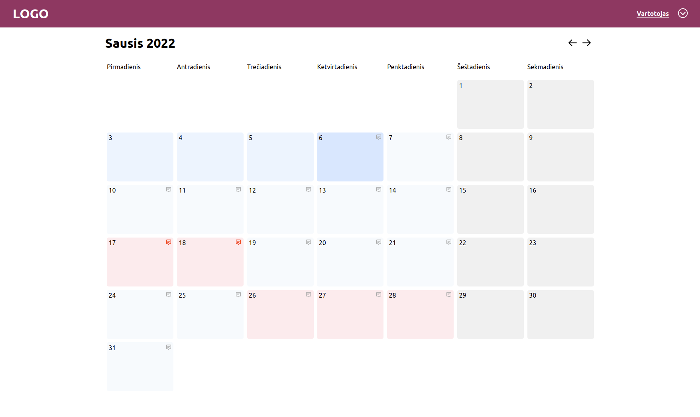
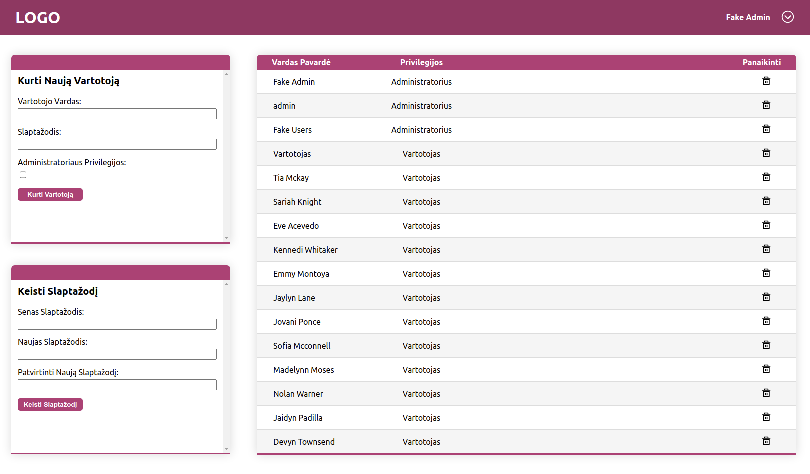

# exp-react-kindergarten

A Web App built for local kindergarten, which eases the comunication between children's parents and teachers.

## Design

The kindergarten needed a better way of comunicating between teachers and parents, however because it only needed basic features (attendance, messaging, diet selection...), the price of a full managing software, and the time required for staff training was not justifiable. This project was built with simplicity in mind, making it easy to learn and use for both teachers and parents. User interaction and predictability was my main goal during development. 

## Main technologies used

- React
- Node.js
- Express
- Postgres
- Typescript (both for server side and cliend side)
- Docker for deployment

### Some parts of the application are removed/hidden as requested by kindergarten!

